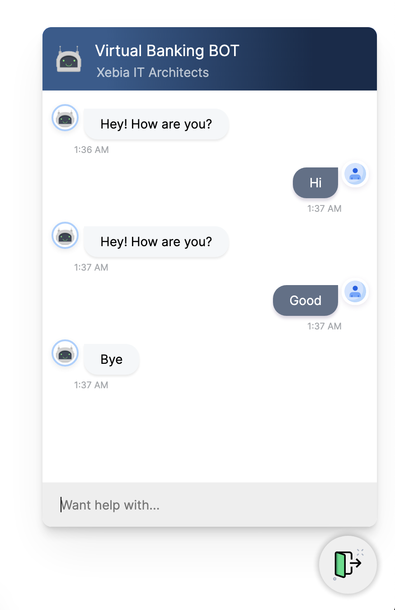

## 🤖 Getting Started With Rasa Chatbot

This repository contains frontend chatbot UI written in React & Rasa initial python project acting as backend. This guide will walk you through installation process for both frontend & backend and how to run it.


#### 📍Prerequisites

You are expected to have following softwares installed already:

1. Python v3.7.3 or v3.7.9
2. Node Js v12 or greater


#### 🗄 Backend Installation & Setup

As per recommendation from Rasa [documentation](https://rasa.com/docs/rasa/installation/#2-virtual-environment-setup), it is advisable to install & run rasa projects in python virtual environment. Please follow below steps to create & install rasa in virtual environment:

##### **Installing Rasa - Windows 10**

1. Clone & extract the repository in your system.

2. Open command prompt (cmd) at root directory, execute `dir` & you should see `requirements.txt` file in output list.

3. Confirm python installation by executing `python3 --version` in cmd, you should see python version installed in output.

4. To create virtual environment execute `python3 -m venv ./venv` in cmd. This will create `venv` directory.

5. To activate virtual envrionment execute `.\venv\Scripts\activate`  in cmd. Now you should see your command prompts starting with `(venv)C:\>...` This means, any python package we install, that will be installed in this virtual environment only. Running programs will utilise packages from virtual environment.

6. Execute `pip3 install -U pip` in cmd to make sure `pip` is up to date.

7. Finally execute `pip3 install -r ./requirements.txt` to install Rasa & its dependencies. This can take lot of time depending on network speed. 

8. To avoid installation errors, It is important to install Rasa & dependencies from provided `requirements.txt` file only.

9. After installation is done, execute `pip3 list`, this will list all the packages installed inside your virtual envrionment (venv).

10. Execute `rasa --version` & you should see output like below

    ```bash
    Rasa Version     : 2.2.5
    Rasa SDK Version : 2.2.0
    Rasa X Version   : None
    Python Version   : 3.7.3
    Operating System : .....
    Python Path      : .....
    ```

    

**Training Rasa Model - Windows 10**

For the purpose of this guide, a sample rasa project is included in `backend` directory. This project was generated using command `rasa init` inside virtual environment.

1. Make sure you are in the root directory of project, execute `dir` & you should see `requirements.txt` file in output list.

2. If cmd prompt doesn't show `(venv)` at start of prompts, then you should activate `venv` by executing `.\venv\Scripts\activate`. Now you should see your command prompts starting with `(venv)C:\>...` 

3. Execute `cd backend` in cmd, execute `dir` & confirm `config.yml` file in output list.

4. Before running Rasa project, you should train the model. To do that execute `rasa train`, this will generate trained model file inside `models` folder. This can take upto 3-4 minutes, depending upon the chatbot training data.

5. After training is done, open `credentials.yml` file in text editor such as vs code & make sure following lines are present in the file

   ```yaml
   socketio:
     user_message_evt: user_uttered
     bot_message_evt: bot_uttered
     session_persistence: false
   ```

   Indentation is very important in `yml` files. Line 2, 3 & 4 are indented by 1-tab space.

6. Finally run the rasa project by executing `rasa run --cors "*"` in cmd. This will start the rasa server like below:

   ```bash
   2021-01-21 01:23:32 INFO     rasa.model  - Loading model models/20210121-011915.tar.gz...
   2021-01-21 01:23:32 INFO     root  - Starting Rasa server on http://localhost:5005
   2021-01-21 01:23:32 INFO     rasa.model  - Loading model models/20210121-011915.tar.gz...
   2021-01-21 01:23:40 INFO     root  - Rasa server is up and running.
   ```

   Please keep a note of url in line 2 above `http://localhost:5005`

7. Keep this running in cmd. The backend setup is complete here.


#### 💻 Frontend Installation & Setup

The frontend is a React Js project. The main component used for chatbot is an open source widget [rasa-webchat](https://github.com/botfront/rasa-webchat). Feel free to go through its documentation.

**Install Frontend dependencies - Windows 10**

1. Launch new command prompt window at the root directory of cloned repository , execute `dir` & you should see `requirements.txt` file in output list.

2. Execute `cd frontend`, then execute `dir` & you should see `package.json` file.

3. To install all dependencies, execute `npm install`. This may take upto 3-4 minutes.

4. Inside `frontend` folder, & inside `src` you will see `config.js` file (`/frontend/src/config.js`). This is were you need to specify `socketUrl` we obtained in step 6 above. You can modify `initPayload` to initial intent your bot is configured for. Other properties like `title, subtitle, etc..` can also be modified to customised bot.

5. Lastly execute `npm run start` in cmd. You should see below output in cmd

   ```bash
   Compiled successfully!
   
   You can now view rasa-chatbot-ui in the browser.
   
     Local:            http://localhost:3000
     On Your Network:  http://192.168.0.102:3000
   
   Note that the development build is not optimized.
   To create a production build, use npm run build.
   ```

6. Open [http://localhost:3000](http://localhost:3000) in browser & you should see chatbot at bottom right of webpage like below.


